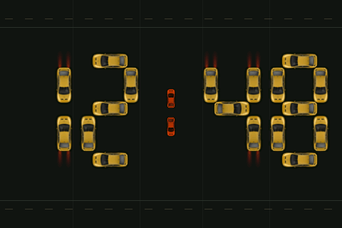
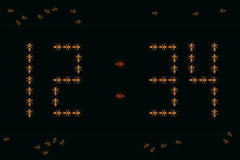

# espClock

I built espClock as an interactive ESP32-S3 touchscreen clock for Home Assistant.
Cars park to form the time, ants walk into place, and glass digits flip as the
minutes change. Swipe the display or choose a mode from Home Assistant.

| Cars | Ants | Flip Glass |
| :---: | :---: | :---: |
|  |  |  |

I captured these 480 × 320 animated previews
from the same C++ renderers used by the ESPHome firmware, running in the
host tests. They show the rendered output; animation speed on the device depends
on its actual frame rate.

## Display modes

### Cars

Cars drive into a seven-segment layout and park with their lights on. When the
time changes, cars leave segments that are no longer needed and replacements
drive into the new positions. Two smaller orange cars form the colon.

Tap a car to squash it: an explosion plays, the damaged car drives away, and a
fresh car takes its place. Both colon cars respond to taps too.


[Cars interaction details](esphome/CARS_TOUCH.md)

### Ants

Seventy ants share the screen. Gold ants gather into the time, red ants form the
colon, and unused ants wander. The artwork has 12 walking frames and 64 headings.
Ants move around one another, scatter around your touch, and send replacements
when you squash one.


The animation shows a minute change, a tap that squashes an ant, and a vertical
drag that scatters nearby ants. [View the walking artwork close-up](esphome/assets/ants_v2/preview/walking.gif).

[Ant artwork, touch behavior, and animation details](esphome/ANTS_V2.md)

### Flip Glass

Rounded glass digits sit above soft reflections. Only digits that change perform
the 1.5-second split-flap animation; the colon stays still. Changes involving
several digits start together, including the transition through midnight.


[Midnight animation](esphome/assets/flip_glass/preview/flip-midnight.gif) ·
[Flip Glass implementation](esphome/FLIP_GLASS.md)

## Controls and Home Assistant

| Control or feature | Behavior |
| --- | --- |
| Swipe left | Cars → Ants → Flip Glass → Cars |
| Swipe right | Cycle through the modes in reverse |
| Tap in Cars | Crush a car and watch its replacement arrive |
| Tap in Ants | Squash an ant, leaving a fading mark and a replacement ant |
| Drag in Ants | Scatter nearby ants; use a vertical drag or hold before moving to avoid a mode swipe |
| Tap in Flip Glass | No action; horizontal swipes still switch modes |
| **Clock Display** select | Change the mode from Home Assistant or an automation |
| Saved selection | Restore the last mode after a restart or power cycle; Cars is the initial default |
| Time | Synchronize from Home Assistant |
| Bluetooth proxy | Relay supported nearby Bluetooth devices to Home Assistant, with active connections enabled |
| **Speaker** media player | Play announcements through the onboard speaker output |
| Diagnostics | Expose online status and Wi-Fi signal strength |
| Wireless updates | Install later firmware builds over ESPHome OTA |

## Hardware

I use the Guition/Jingcai **JC3248W535** family with an **ESP32-S3 N16R8**:

- 16 MB flash and 8 MB octal PSRAM.
- 3.5-inch 320 × 480 IPS display with an AXS15231B controller.
- Capacitive touch, with the screen used in landscape at 480 × 320.
- Onboard I²S speaker output.

The configuration contains the display, touch, backlight, and audio pin mapping
for this board. Check your board revision before flashing; a different display
with the same screen size can use different wiring or controllers.

## Install with ESPHome

The current three-mode firmware is in [`esphome/`](esphome/). Its configuration
requires **ESPHome 2026.7.0 or later** and uses ESP-IDF. Home Assistant supplies
the time and the mode selector.

1. Clone or download this repository:

   ```sh
   git clone https://github.com/moryoav/espClock.git
   ```

2. Copy the contents of `esphome/` into your ESPHome configuration directory,
   keeping headers beside `espclock.yaml` and preserving the `assets/` paths.
   In Home Assistant, this is normally `/config/esphome/`.
3. Add `wifi_ssid` and `wifi_password` to your existing `secrets.yaml`. For a new
   setup, copy [`secrets.example.yaml`](esphome/secrets.example.yaml) to
   `secrets.yaml` and fill in your Wi-Fi settings. Keep existing secrets if you
   already have other devices configured.
4. Open `espclock.yaml` in ESPHome Device Builder and select **Validate**.
   Adjust the device name if you are installing more than one clock. Set an
   explicit `timezone` under `time:` if the build environment uses a different
   timezone from your clock.
5. For a first installation, connect the board by USB and install the firmware
   through ESPHome. Once it is running on Wi-Fi, later updates can use
   **Install → Wirelessly**.
6. Add the discovered ESPHome device in Home Assistant. The supplied device name
   is **ESPClock** and its hostname is `espclock`.
7. Choose **Cars**, **Ants**, or **Flip Glass** from **Clock Display**, or swipe
   the touchscreen.

The configuration uses local Wi-Fi secrets. You can also configure ESPHome API
encryption and OTA authentication for your installation.

[Firmware file list and setup notes](esphome/README.md)

## Try the desktop preview

From the repository root, run:

```sh
python -m http.server 8000 --directory pc
```

Open **http://localhost:8000**. The browser preview includes Cars with the tap
animation and an earlier Ants implementation. I use it for quick visual
experiments; it does not include Flip Glass or exactly reproduce the current
firmware's Ants renderer.

[Desktop preview guide](pc/README.md)

## Project layout

| Directory | Contents |
| --- | --- |
| [`esphome/`](esphome/) | Current Cars, Ants, and Flip Glass firmware, assets, documentation, and host tests |
| [`pc/`](pc/) | Interactive desktop/browser preview |
| [`html/`](html/) | Original standalone browser ant-clock prototype |
| [`esp32/`](esp32/) | Earlier standalone PlatformIO ant-clock port, with its own setup guide |

The older `ant_clock` and `ants_v2` source identifiers are retained where the
implementation still uses them. The project is now called **espClock**.

## Development checks

The existing host tests compile the actual C++ renderers and check touch
handling, gestures, sprite rendering, transitions, and framebuffer bounds. The
Flip Glass tests cover every minute boundary in a full day. They also regenerate
the firmware screenshots used in this README.

With Python, Pillow, NumPy, and MSVC on Windows or g++ on Linux, run from the
repository root:

```sh
python -m pip install -r esphome/tools/requirements-ants-v2.txt
python esphome/tests/verify_cars.py
python esphome/tests/verify_car_explosion.py
python esphome/tests/verify_ants_v2.py --preview
python esphome/tests/verify_flip_glass.py
node --check pc/app.js
```

Build products are kept outside the source tree. After configuring your local
secrets, validate and compile the device firmware from `esphome/`:

```sh
esphome config espclock.yaml
esphome compile espclock.yaml
```

Host checks verify rendering and behavior in simulation. Physical touch, audio,
Bluetooth reception, and display performance need testing on the board.

The earlier ports retain their [license](esp32/LICENSE.txt) and
[third-party notices](esp32/THIRD_PARTY_NOTICES.md).
