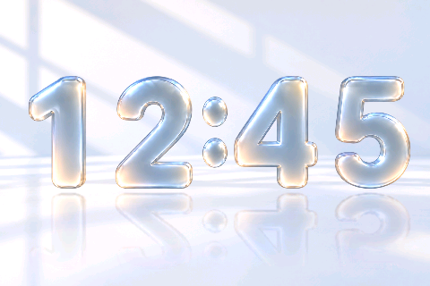

# Flip Glass Light

A separate light face using the approved clear-glass digits, pale blue-white
daylight background, window shadows, and long floor reflections. Select
**Flip Glass Light** in Home Assistant's **Clock Display**, or swipe left through
Cars → Ants → Flip Glass → Flip Glass Light → Cars. Swipe right reverses the cycle.
The selection is saved across restarts.



## Artwork and animation

The ten digits and colon are separate RGBA sprites, each in a 100 × 128 cell.
The renderer composites their transparency over the background rather than
putting an opaque rectangle around each digit. The approved source artwork,
extracted PNGs, and browser design simulation are retained under
`assets/flip_glass_light/proposal/`.

The logical display is 480 × 320. Digits start at y=84, with 100-pixel reflections
below them and a five-pixel bottom margin. Only changed digits perform the
1.5-second split-flap animation. Carry changes start together, the colon stays
still, and the reflections follow the animated transparent digit layer.
Integer pixel sampling and reflection blur differ slightly from the browser's
canvas smoothing; host validation checks the actual firmware output against
the approved static design.

Mode entry synchronizes directly to the current time. Before valid time arrives,
the background and colon are shown. Static frames do not repeat display transfers.
During animation, each changing digit restores its background strip, redraws its
digit and reflection, and sends a contiguous native strip to the panel. The
original dark Flip Glass renderer and artwork remain unchanged.

The reflection blur uses separate horizontal and vertical passes with packed
channel pairs. This keeps its pixels identical to the direct 3 × 3 filter while
reducing PSRAM reads during animation.
Flap drawing also follows the layer's column order to avoid cache conflicts
while the digits turn.

## Firmware files and memory

Copy `espclock.yaml`, `flip_glass_light_renderer.h`, and
`flip_glass_light_assets.h` alongside the existing firmware files. Both original
Flip Glass headers remain required because the light face shares its digit
transition state machine.

The generated light assets occupy 870,500 bytes in flash: premultiplied ARGB
digits, a native-order RGB565 background, and reflection fade values. Two buffers
totaling 552,960 bytes are allocated in PSRAM on first use. There are no per-frame
heap allocations. The PNG source files are only needed for development.

## Build and verify

From the repository root, with the same Python dependencies and compiler as the
other host tests:

```sh
python esphome/tools/build_flip_glass_light_assets.py
python esphome/tests/verify_flip_glass_light.py
python esphome/tests/verify_flip_glass.py
```

The packer reads the approved extracted PNGs without regenerating the artwork.
The manifest records their hashes. Host tests cover every minute boundary,
synchronized carries, partial/full redraw equivalence, pixel-exact transparent
compositing in all four positions, rotation, background preservation, clipping
guards for both buffers, dropped frames, timer wraparound, and mode re-entry.

Previews captured from the actual C++ framebuffer:

- [12:45 static frame](assets/flip_glass_light/preview/clock.png)
- [12:45 → 12:46](assets/flip_glass_light/preview/flip-12-45-to-12-46.gif)
- [23:59 → 00:00](assets/flip_glass_light/preview/flip-midnight.gif)

Device logs report transition duration, frame count, and maximum drawing/transfer
time. Host tests do not prove physical touch response or display appearance.
