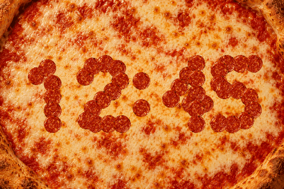

# Pizza clock

Pizza uses the approved cheese background and six pepperoni textures. Rounded
digits are assembled from individual slices; two more slices form the colon.
Only changing digits are eaten. Four staggered bites remove each old slice,
then new slices drop into place. A complete transition takes 3.6 seconds.



[Midnight animation](assets/pizza/preview/midnight.gif)

## Controls

Choose **Pizza** in Home Assistant's **Clock Display** selector, or swipe from
Flip Glass Light. Swiping left from Pizza returns to Cars; swiping right goes
back to Flip Glass Light. Taps have no action. The selected face is restored
after a restart, and entering Pizza shows the current time immediately.

## Artwork and rendering

- `assets/pizza/proposal/` holds the approved browser simulation, artwork,
  digit sheet, bite stages, and generation prompts.
- `tools/build_pizza_assets.cjs` packs the same slice masks and digit geometry
  into `pizza_assets.h`. The header contains 1,415,522 bytes of artwork and geometry.
- `pizza_renderer.h` draws rotated, smoothly sampled slices with alpha and
  shadows over the background. Slice placement, bite timing, and shapes follow
  the browser simulation. Settled and bitten slices are rasterized during the
  asset build and stored as compact column spans. Only falling slices need
  runtime rotation and sampling. Baked shadows keep runtime work small.
- A 307,200-byte framebuffer is allocated in PSRAM when the mode is first used.
  Static frames do not trigger repeated transfers. Transitions restore and
  redraw a strip containing changed digits and any overlapping neighbors.
- Pixels are stored in native rotated, big-endian RGB565 order so panel updates
  use contiguous transfers. No temporary buffers are allocated per frame.

The browser proposal is a design reference; `assets/pizza/preview/` contains
captures from the actual C++ firmware renderer. Runtime frame rate depends on
the device. The source artwork is embedded in the header and need not be copied
to the device separately.

## Rebuild and validate

With Node.js and `@napi-rs/canvas` available:

```sh
node esphome/tools/build_pizza_assets.cjs
```

With Python, Pillow, NumPy, and MSVC or g++:

```sh
python esphome/tests/verify_pizza.py
```

The host checks cover all 1,440 minute boundaries, changed digits only, carries,
midnight, timer rollover, interrupted time updates, dropped frames, framebuffer
bounds, mode re-entry, unchanged pixels, background restoration after eating,
and exact equivalence between partial and full redraws. They also compare the
static output with the approved preview and export both animation GIFs above.
